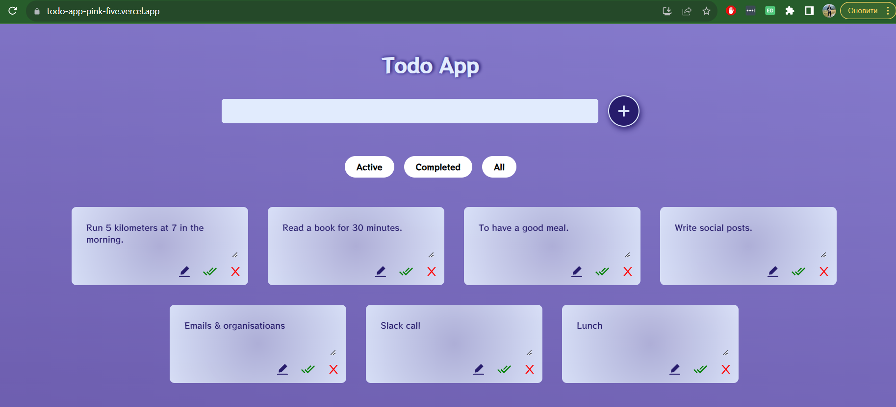

# TODO react-redux app

Todo List App with Redux and React with Awesome animation using Framer motion.

[Link](https://todo-app-pink-five.vercel.app/)

___
## Installation:
In the project directory, you can run:

1. Clone the repository
```
git clone https://github.com/AndrewTihonyuk878/todo-app.git
```

2. Install all packages 
```
npm install
```

3. Runs the app in the development mode.
```
npm start
```
4. Open http://localhost:3000 to view it in the browser.
5. Launches the test runner in the interactive watch mode.
```
npm test
```
___

## Preview:

